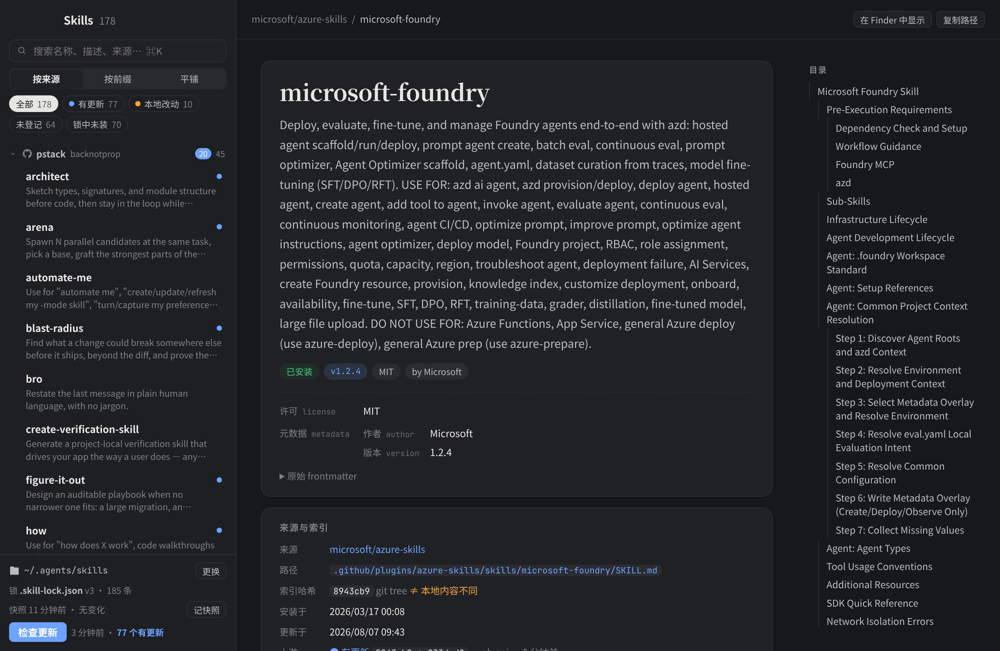
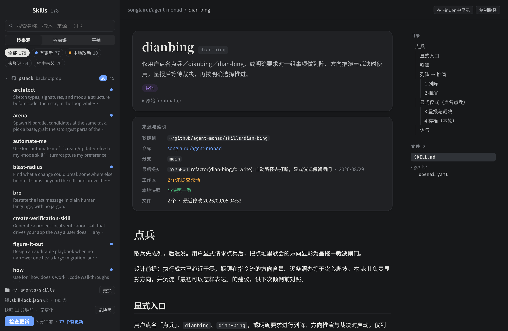
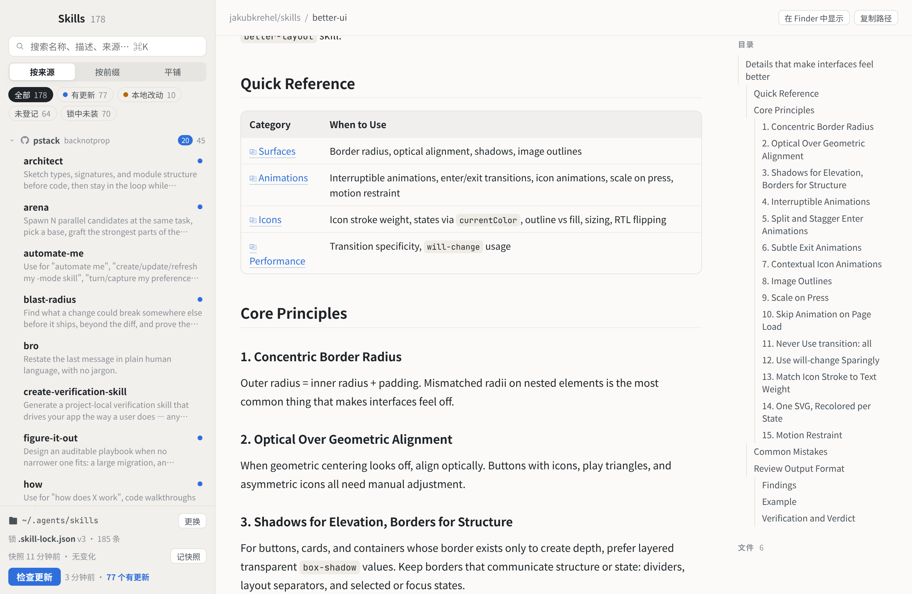

<p align="center"></p>

# Skills Reader

A small macOS/desktop reader for agent skills in `~/.agents/skills`, built with [MyGo](https://mygo.egoist.dev) ([egoist/mygo](https://github.com/egoist/mygo)) — Go backend + web frontend in the system webview.

用 MyGo 写的桌面应用，阅读 `~/.agents/skills` 下的 agent skills：按来源分组、舒服的 Markdown 排版、友好的 frontmatter 卡片，并沿用 [vercel-labs/skills](https://github.com/vercel-labs/skills) CLI 的 `.skill-lock.json` 做索引版本与更新检查。

## Screenshots

**macOS 原生窗口**


> 以下三张由真实运行中的应用导出页面后渲染（无 macOS 原生标题栏）。

**frontmatter 卡片 + 来源与索引（暗色）**



**中文排版 · 软链 skill 的仓库信息（暗色）**



**表格与目录（亮色）**



## 运行

需要 Go（go.mod 要求 1.27.1，较旧的 Go 会由 `GOTOOLCHAIN=auto` 自动拉取）和 Bun。

```sh
git clone https://github.com/songlairui/skills-reader && cd skills-reader
bun install
bun run dev      # 开发：mygo dev，Vite 热更新，改 Go 自动重启
bun run build    # 打包：build/darwin-arm64/Skills Reader.app 与 .dmg
open "build/darwin-arm64/Skills Reader.app"
go test ./...    # 单测；若存在 ~/.agents/skills 也会做一次只读扫描
```

## 功能

- 默认读 `~/.agents/skills`，左下角「更换」可选其他目录（记在 localStorage），「默认」切回。
- **分组**（左上切换）：按来源 / 按前缀 / 平铺。来源分组规则见 [ADR 0001](docs/adr/0001-grouping-and-update-check.md)。
- 搜索（⌘K）覆盖名称、描述、来源、子分类、标签；↑↓ 切换；⌘R 重新扫描；窗口重新获得焦点时自动重扫。
- 过滤：有更新 / 本地改动（与锁哈希不一致）/ 快照后变化 / 未登记 / 锁中未装。
- 阅读：Markdown（markdown-it + DOMPurify 净化 + highlight.js 高亮）、CJK 字体栈、表格、代码复制、目录、跟随系统明暗。
- frontmatter 卡片：name 作标题、description 作导语，版本 / 许可 / 作者 / 标签 / `disable-model-invocation` 变成徽章，其余字段（含嵌套 `metadata`）按键值展示，可展开原始 YAML；YAML 解析失败时按行兜底并提示。
- 「来源与索引」卡：来源仓库、skillPath、锁哈希（与本地是否一致）、安装/更新时间、上游检查结果与 `npx skills update <id> -g` 命令；软链 skill 显示目标、所在仓库分支、最后提交与未提交改动。
- 右栏列出 skill 目录下所有文件，点开即读（md 渲染，其余高亮）；正文里的相对链接也在应用内打开，图片经 `skillfile://` 协议加载。

## 调试探针

`SKILLS_READER_PROBE=<dir>` 启动时，应用会自己驱动窗口（等列表出现，可选 `SKILLS_READER_PROBE_CHECK=1` 点「检查更新」，`SKILLS_READER_PROBE_OPEN=a,b` 依次打开 skill），把页面状态 JSON 与 HTML 写进 `<dir>`。不设变量则什么都不做。

```sh
open -n --env SKILLS_READER_PROBE=$PWD/.scratch/probe --env SKILLS_READER_PROBE_OPEN=tdd,better-ui "build/darwin-arm64/Skills Reader.app"
```
